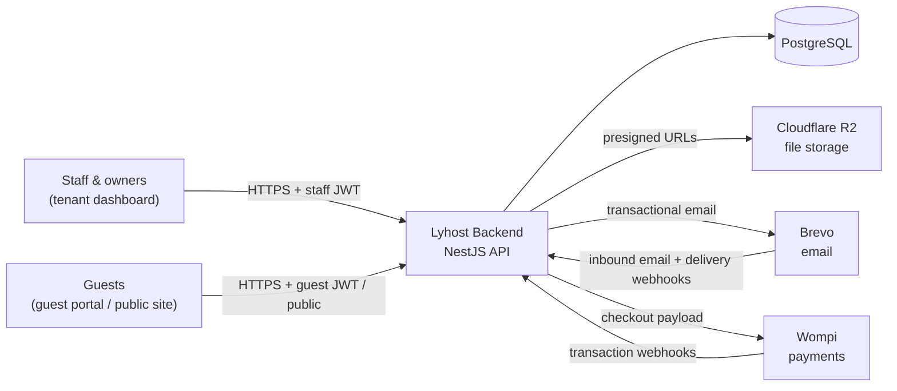
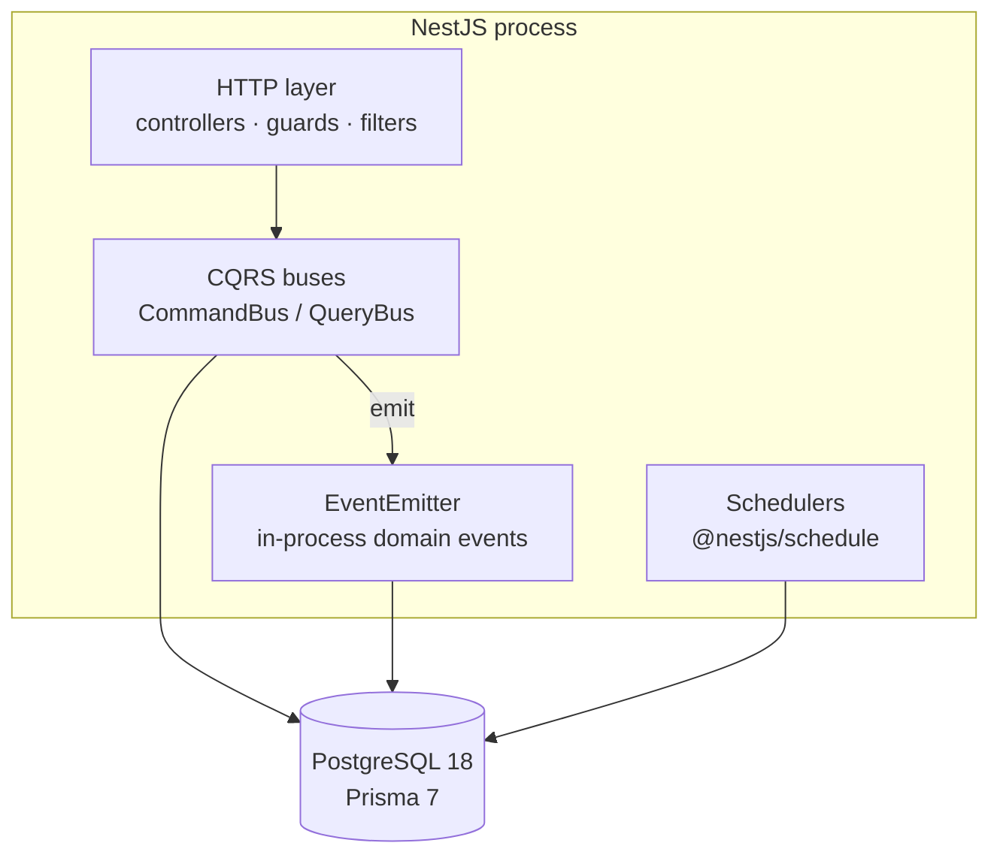
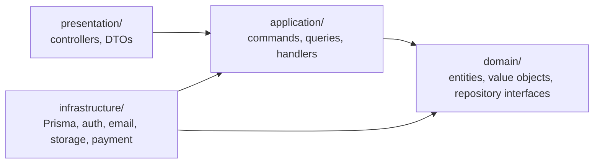

# Architecture

How the Lyhost backend is built: what sits around it, how the code is layered, and the
cross-cutting rules every module follows. For the reasoning behind each choice, see the
[ADRs](../adr/). For step-by-step request flows, see [data-flows.md](data-flows.md). For the schema, see [database.md](database.md). For HTTP conventions, see [api.md](api.md).

## 1. System context

Who and what the backend talks to.



- **Staff and owners** manage a tenant: properties, units, reservations, guests,
  inventory, shifts, incidents, metrics.
- **Guests** have their own accounts. They browse public units, book, pay, buy
  experiences, and message the property.
- A **tenant** is one client business. Everything a tenant owns is scoped by `tenantId`.

## 2. Containers



A single deployable NestJS app. It has no message broker and no separate workers:
events and scheduled jobs run inside the same process.

## 3. Layers (Clean Architecture)

Dependencies only point inward:



| Layer | Contains | Must not |
|---|---|---|
| `src/domain/` | Entities (aggregates), value objects, repository **interfaces**, domain errors | Import NestJS, Prisma, or anything else outside the domain |
| `src/application/` | One command or query plus its handler per use case. Handlers orchestrate entities and repositories, and emit events | Know about HTTP or SQL |
| `src/infrastructure/` | Prisma repository implementations, JWT strategies and guards, Brevo, R2, Wompi, schedulers, event listeners | Contain business rules |
| `src/presentation/` | Controllers, request and response DTOs, validation, Swagger | Do anything beyond mapping HTTP to a command or query and back |

Repository interfaces are bound to their implementations with injection tokens, for
example `@Inject(UNIT_REPOSITORY)`. Handlers never see Prisma.

Each layer is split by **feature**, and a feature uses the same folder name in every
layer:

```
src/domain/reservation/          entities, value objects, ReservationRepository
src/application/reservation/     commands/, queries/
src/infrastructure/persistence/  repositories/prisma-reservation.repository.ts
src/presentation/controllers/    reservation.controller.ts, guest-reservation.controller.ts
```

## 4. Module map

| Area | Features (`src/domain/*`) |
|---|---|
| Tenancy & access | `tenant`, `user`, `role`, `auth` |
| Properties | `property`, `unit`, `unit-rating` |
| Bookings | `reservation`, `cart`, `payment`, `refund` |
| Guests (CRM) | `guest`, `guest-account`, `guest-note`, `guest-tag`, `guest-preference` |
| Communication | `conversation`, `guest-message`, `guest-email` |
| Experiences | `experience`, `experience-purchase` |
| Operations | `inventory`, `shift`, `incident-report` |
| Insight | `metrics`, `audit` |
| Shared | `shared` (IDs, `Email`, base classes, domain exceptions) |

Staff endpoints and guest endpoints are separate controllers, for example
`reservation.controller.ts` and `guest-reservation.controller.ts`, because each side
authenticates differently and sees different data.

## 5. Cross-cutting concerns

### Authentication

There are two separate JWT audiences:

- **Staff JWT** (`src/infrastructure/auth/`). The payload carries `userId`, `tenantId`,
  `isOwner`, `roleAssignments` (with their resolved permissions), `activePlan`, and
  `trialEndsAt`.
- **Guest JWT** (`src/infrastructure/guest-auth/`), with its own strategy and guard.

Global guards (`src/app.module.ts`):

1. `JwtAuthGuard` requires a valid staff token unless the route is marked `@Public()`.
2. `TrialExpiredGuard` returns `403` once the tenant's trial has ended.

### Authorization (RBAC)

Authorization is applied per route with decorators:

- `@RequirePermission(...)` → `PermissionGuard`: the user needs the permission in at least
  one of their role assignments.
- `@RequireScope(...)` → `ScopeGuard`: the assignment must cover the specific resource in
  the URL (for example, a property).
- **Owners bypass both.** `isOwner` grants full access inside their own tenant.

Permissions are embedded in the JWT, so no database lookup happens per request. See
ADR-004 to ADR-006.

### Multi-tenancy

- `tenantId` always comes from the verified token and never from the request body.
- Handlers pass it to every repository call, and they check that a resource belongs to
  the tenant before acting on it.
- The Postgres schema adds foreign-key and CHECK constraints so rows can't cross tenants.
  `test/integration/` covers this.

### Domain events

Handlers emit events through `EventEmitter2` after saving. Listeners in `infrastructure/`
react to them:

| Event | Listener |
|---|---|
| `AUDIT_LOG_EVENT` | writes an audit log entry (most state changes) |
| `guest-email.created`, guest message created | sends the email through Brevo |
| `LOW_STOCK_ALERT_EVENT` | inventory alert |
| `TENANT_REGISTERED_EVENT` | seeds the tenant's guest-preference catalog |

Events are in-process and fire-and-forget. If the process crashes after a save and before
a listener runs, that side effect is lost.

### Scheduled jobs

| Job | When | What |
|---|---|---|
| `ExpirePendingReservationsScheduler` | every 5 min | Cancels or reopens carts stuck in pending payment for more than 10 min with no active payment session |
| `ReservationCheckinScheduler` | 23:00 daily | Auto check-in for confirmed reservations due that day |

### Persistence

- PostgreSQL, accessed through Prisma 7 (`src/infrastructure/persistence/prisma/`).
- The schema is split by area in `prisma/schema/*.prisma`, and `prisma/migrations/` is the
  source of truth.
- Multi-aggregate writes go through the transaction manager in
  `src/infrastructure/persistence/transaction/`. For example, approving a payment confirms
  the reservation and creates the experience purchases in one transaction.
- Files are stored in R2. The database stores the **object key** and never the URL; the
  public URL is built when the record is read.

### Errors

`DomainExceptionFilter` (`src/presentation/common/filters/`) maps errors to responses:

- `DomainException` → `400`
- NestJS `HttpException` → its own status
- anything else → `500` with a generic message (the details are only logged)
