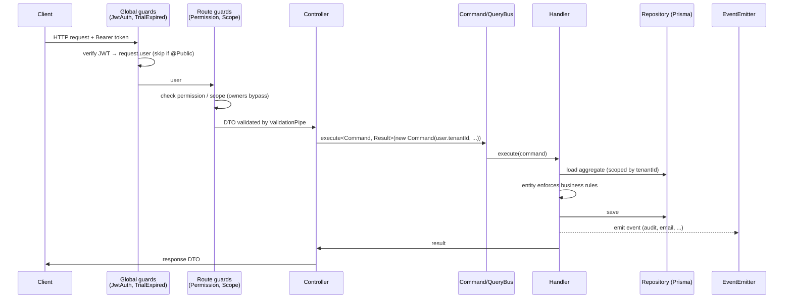
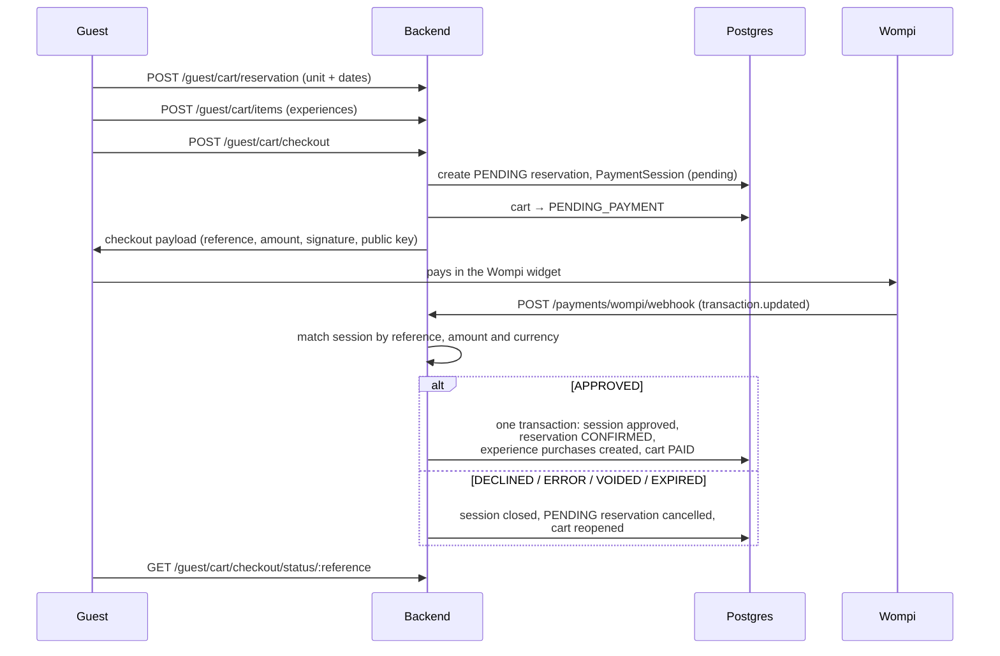

# Data flows

How the main requests move through the system. For the structure these flows run on,
see the [architecture overview](README.md).

## 1. Request lifecycle (any endpoint)

An error at any step is converted by `DomainExceptionFilter`: a domain rule violation
returns `400`, and an unexpected error returns `500`.

## 2. Staff login

1. `POST /auth/login` (public) → `LoginHandler`.
2. The handler checks the password with bcrypt and resolves the user's role assignments
   and permissions.
3. It returns an access token and a refresh token. The payload includes `tenantId`,
   `isOwner`, `roleAssignments`, and `trialEndsAt`.
4. Later requests send the access token. `POST /auth/refresh` issues a new one.

Guests follow the same pattern with `POST /guest/auth/login` and a separate guest JWT.

## 3. Guest booking: cart → checkout → payment

- The amount is sent to Wompi in cents: COP × 100.
- The webhook is the **only** way a payment is confirmed. The browser redirect never
  confirms anything.
- A second checkout on the same cart expires the previous pending session.
- **Abandoned payments:** every 5 minutes `ExpirePendingReservationsScheduler` finds carts
  that have been pending payment for more than 10 minutes with no active session, and
  releases their reservations.

## 4. Reservation lifecycle

```mermaid
stateDiagram-v2
    [*] --> PENDING: guest checkout / staff create
    PENDING --> CONFIRMED: payment approved
    PENDING --> CANCELLED: payment failed / expired
    CONFIRMED --> CHECKED_IN: staff check-in or 23:00 auto check-in
    CONFIRMED --> CANCELLED: cancel (guest or staff; may create a refund)
    CONFIRMED --> NO_SHOW: mark no-show
    CHECKED_IN --> CHECKED_OUT: check-out
    CHECKED_IN --> CANCELLED: cancel
```

Every transition is a method on the `Reservation` entity. An invalid transition throws a
domain error, which the API returns as `400`. Each transition also writes an audit log
entry.

## 5. File upload (R2)

1. The client calls `POST /storage/presigned-url` with the file type and size. Only allowed
   image types are accepted, up to 5 MB.
2. The backend returns a short-lived presigned PUT URL and the object **key**.
3. The client uploads the file **directly to R2**; the file never passes through the API.
4. The client sends the key back on the owning resource (for example a unit photo or a
   guest document), and the backend stores the key.
5. On read, the backend builds the public URL from the key.

## 6. Email: outbound and inbound

- **Outbound.** A handler saves a guest message or email, and emits `guest-email.created`
  or the guest message created event. The listener sends it through Brevo.
- **Delivery tracking.** Brevo calls `POST /communications/webhook/email/events`, which
  updates the message's delivery status (delivered, opened, and so on).
- **Inbound.** Brevo forwards replies to `POST /communications/webhook/email/inbound?tenantId=...`.
  The backend verifies the `x-brevo-signature` against the raw body and attaches the email
  to the guest's conversation. This endpoint is disabled unless `EMAIL_INBOUND_ENABLED=true`.

## 7. Tenant registration

1. `POST /auth/register` (public) creates the tenant (with its trial end date) and the owner
   user, and returns access and refresh tokens straight away.
2. A verification email is sent. If sending fails, the registration is not rolled back;
   the user can ask for the email again. `TENANT_REGISTERED_EVENT` fires.
3. A listener seeds the tenant's default guest-preference catalog.
4. Once `trialEndsAt` passes, `TrialExpiredGuard` blocks the tenant's requests with `403`
   until the plan is upgraded.
