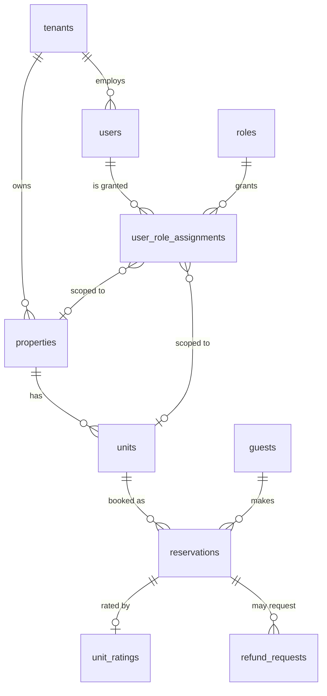
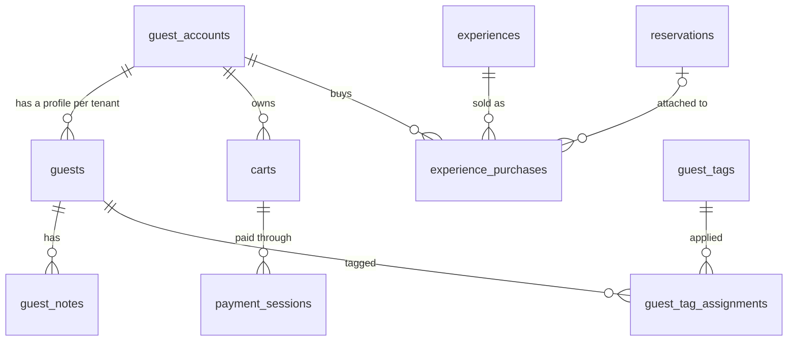
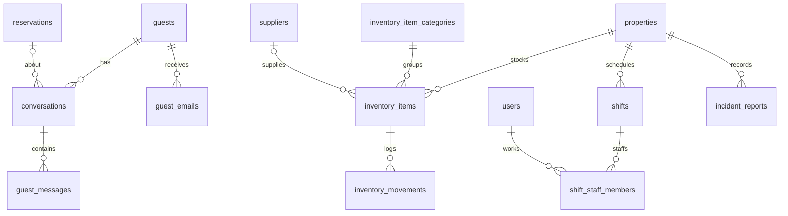

# Database

How the PostgreSQL database is organised and the rules it enforces. For *why* we moved
from MongoDB to Postgres, see [ADR-018](../adr/018-postgresql-prisma.md). For the
step-by-step migration workflow, see [CONTRIBUTING.md § 4](../../CONTRIBUTING.md#4-database-changes-only-if-the-schema-changes).

## 1. Overview

| | |
|---|---|
| Engine | PostgreSQL 18 (extensions: `citext`) |
| Access | Prisma 7, with the generated client in `src/infrastructure/persistence/prisma/generated/` |
| Schema | `prisma/schema/*.prisma`: one file per area, loaded as a directory by `prisma7.config.ts` |
| Source of truth | `prisma/migrations/`: the SQL that actually runs. Some rules exist **only** there (see § 5) |

Schema files:

| File | Tables |
|---|---|
| `schema.prisma` | generator and datasource, plus the conventions comment |
| `tenant.prisma` | `tenants`, `users`, `roles`, `user_role_assignments` |
| `property.prisma` | `properties`, `units` |
| `reservation.prisma` | `reservations`, `unit_ratings` |
| `guest.prisma` | `guest_accounts`, `guests`, `guest_notes`, `guest_tags`, `guest_tag_assignments`, `guest_preference_catalog_items` |
| `commerce.prisma` | `carts`, `payment_sessions`, `experiences`, `experience_purchases`, `refund_requests` |
| `messaging.prisma` | `conversations`, `guest_messages`, `guest_emails` |
| `inventory.prisma` | `inventory_items`, `inventory_item_categories`, `inventory_movements`, `suppliers` |
| `ops.prisma` | `shifts`, `shift_staff_members`, `incident_reports`, `audit_logs` |

## 2. Entity relationships

Nearly every table has a `tenant_id` pointing to `tenants`. Those edges are left out of
the diagrams below so they stay readable.

### Core: tenancy, properties, bookings



### Guests and commerce



- **`guest_accounts`** is a guest's **login**, and it is global: one account works across
  every tenant.
- **`guests`** is a tenant's **CRM profile** for that person: one row per tenant, optionally
  linked to an account. See ADR-008.
- **`carts`** belong to the account, not to a tenant. The cart items are `jsonb`, and the
  tenant is resolved from the items at checkout.

### Messaging and operations



`audit_logs` is append-only, keyed by `(entity_type, entity_id)` rather than by foreign
keys.

## 3. Conventions

These come from the header comment in `prisma/schema/schema.prisma`.

| Concern | Rule |
|---|---|
| Table and column names | `snake_case`, plural table names (`guest_accounts`) |
| IDs | `uuid`, default `uuidv7()`: time-ordered, so inserts append to the index. Rows created before the change keep their v4 IDs |
| Timestamps | `timestamptz`. `created_at` and `updated_at` default to `now()` |
| Enums | `text` + `CHECK (col IN (...))`. The enum lives in TypeScript, and the database only validates the value. Adding a value means altering the CHECK. Exceptions with no CHECK: `roles.permissions` and `audit_logs.action` |
| Money | COP amounts in `bigint` (`price_cop`, `amount_in_cents`); nightly prices in `numeric(14,2)` |
| Emails | `citext`, so uniqueness is case-insensitive |
| Value objects | flattened into columns when small; `jsonb` when they are lists or blobs (unit bedrooms, cart items, check-in info, attachments) |
| Files | store the R2 **key** (`image_key`, `logo_key`, `media_keys`), never the URL |

### Soft vs hard delete

Tables with `deleted_at` are **soft-deleted**:

- `tenants`, `users`, `properties`, `units`
- `unit_ratings`, `guest_notes`, `experiences`
- `guest_messages`, `inventory_items`, `suppliers`, `incident_reports`

Their unique constraints are **partial** (`WHERE deleted_at IS NULL`), so a deleted row
doesn't block reusing an email, SKU, or NIT.

Reservations are never deleted; they move to `CANCELLED`. Every other table is deleted
for real, usually by cascade from its parent.

### Global vs tenant-scoped

- **No `tenant_id` (global):** `tenants`, `roles` (system roles; see ADR-006),
  `guest_accounts`, `carts`.
- **Scoped through their parent:** `guest_tag_assignments`, `shift_staff_members`.
- **Nullable `tenant_id`:** `guest_tags`, where `NULL` marks a platform-wide tag. The
  domain represents it as `'__platform__'` (`GuestTag.PLATFORM_TENANT_ID`), and the
  repository maps that value to `NULL` and back.
- **Everything else** has a `tenant_id` and an index on it.

## 4. Tenant isolation in the database

The application always filters by the `tenantId` from the JWT. On the core chain, the
database also **makes cross-tenant rows impossible** by using **composite foreign keys
that include `tenant_id`**:

```sql
-- units: the property must belong to the same tenant
FOREIGN KEY (tenant_id, property_id)       REFERENCES properties (tenant_id, id)
-- reservations: unit AND guest must belong to the reservation's tenant,
-- and the unit must belong to the claimed property
FOREIGN KEY (tenant_id, property_id, unit_id) REFERENCES units (tenant_id, property_id, id)
FOREIGN KEY (tenant_id, guest_id)             REFERENCES guests (tenant_id, id)
```

For this to work, each parent carries a matching unique key: `@@unique([tenant_id, id])`,
or `[tenant_id, property_id, id]` on `units`.

| Relationship | Protected by the database |
|---|---|
| unit → property | ✅ composite FK |
| reservation → unit (+ property) | ✅ composite FK |
| reservation → guest | ✅ composite FK |
| role assignment → user / property / unit | ✅ composite FK |
| everything else (inventory, shifts, messaging, experiences, …) | ❌ plain FK on `id`; isolation is enforced **only by the application** |

`test/integration/schema-constraints.spec.ts` proves the ✅ rows: it tries to write
cross-tenant data and expects the database to reject it.

When you add a table that references a tenant-scoped parent, prefer a composite FK: add
`tenant_id` to both sides and reference `(tenant_id, id)`.

## 5. Rules that live only in migrations

Prisma can't express **CHECK constraints**. They are written in the migration SQL
(`prisma/migrations/0_init/migration.sql`), and `schema.prisma` only marks the affected
models with a `/// This table contains check constraints` comment. Examples:

| Table | Rule |
|---|---|
| `reservations` | `check_out > check_in`; `guests_count > 0`; `status` and `source` restricted to the enum values |
| `units` | `standard_guests <= max_guests`; `inventory_count >= 0`; `rating BETWEEN 0 AND 5` |
| `user_role_assignments` | `TENANT` scope ⇒ no property or unit; `PROPERTY` ⇒ a property but no unit; `UNIT` ⇒ both |
| `experiences` | `scope = 'PROPERTY'` ⇔ `property_id IS NOT NULL`; `minimum_participants <= capacity` |
| `refund_requests` | `status = 'PENDING'` ⇔ `reviewed_at IS NULL` |
| `payment_sessions` | `amount_in_cents > 0`; `currency = 'COP'` |
| every enum column | `CHECK (col IN (...))` |

**Why this matters:** `prisma migrate dev` generates SQL from the `.prisma` files, which
don't know about these CHECKs. A generated migration can therefore **drop or rewrite a
CHECK without any warning**. Always read the generated SQL before committing, and add
the CHECKs for a new column or enum value **by hand** in the migration file.

Other SQL-only details that Prisma shows only as `raw(...)`:

- **Partial unique indexes:** for example one `OPEN` cart per guest account, a unique
  `provider_reference` when it isn't null, and the soft-delete uniques.
- **Partial indexes:** for example non-cancelled reservations by unit and dates, and
  low-stock inventory items.

## 6. Migrations

| History | |
|---|---|
| `0_init` | Baseline created during the MongoDB → Postgres move (LYMON-1128) |
| `20260909000000_drop_external_reservation_id` | Reservations are no longer imported from external platforms |
| `20260910000000_uuidv7_ids` | New IDs default to `uuidv7()` |

- **Local:** `pnpm db:migrate --name <change>` creates the migration and applies it.
  `pnpm db:reset` rebuilds the database from scratch.
- **Other environments:** `prisma migrate deploy` (`pnpm db:deploy`) applies pending
  migrations and never generates new ones.
- **Never** edit a migration that has already been merged. Write a new one.

## 7. Local and test databases

| Database | Where | Used by |
|---|---|---|
| `lymon` | Docker `lymon-pg`, `127.0.0.1:5433` (`pnpm db:up`) | `pnpm start:dev`; dev seeds run on boot when `isDevelopment=true` |
| `lymon_test` | same server, created by `test/integration/global-setup.ts` | `pnpm test:db`: dropped, recreated and migrated on every run, and tables are truncated between tests |

In CI, `DATABASE_URL` points at a throwaway Postgres container, and `pnpm test:db`
builds `<db>_test` the same way.

## Known gaps

- **Plain foreign keys outside the core chain.** Tenant isolation there depends on the
  application (see § 4).
- **No trigger maintains `updated_at`.** It is only correct when the repository sets it on
  update.
